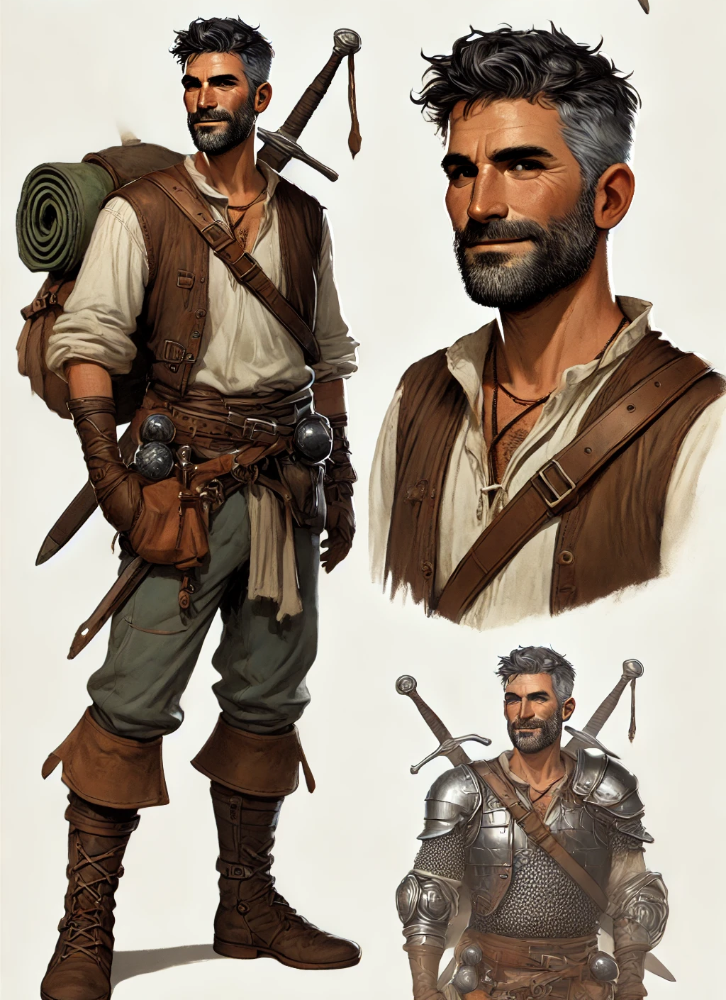

# Appearance
 **Osbert** is a middle aged [[human]] male (early 40s), with wavy hair cut in a simple crew cut, dark hair that is speckled with gray. He has a full beard, kept relatively short and clean, which is similarly dark but speckled with gray. He has tanned skin, and his face has the start of some wrinkles forming. 
 
 Osbert dresses in simple traveling leathers and cloths, over top of which he wears chain mail. He travels simply, with a travelers pack with essential outdoor gear. He also carries a shield on his back, a cudgel and longsword sheathed at his side. 

The longsword is a double edged blade of simple but fine construction. It is well oiled and maintained. On each of the blade’s four flat faces, runes of the [[common]] tongue have been engraved into a word. On one side: “peace”, “innocence”, on the other: “wisdom”, “patience”. The engraving does not appear to be professional work.

source: microsoft copilot (not perfect, but good enough to start)
# History

# Notes

