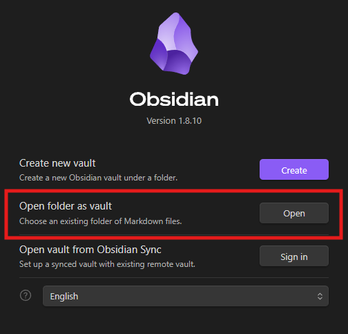
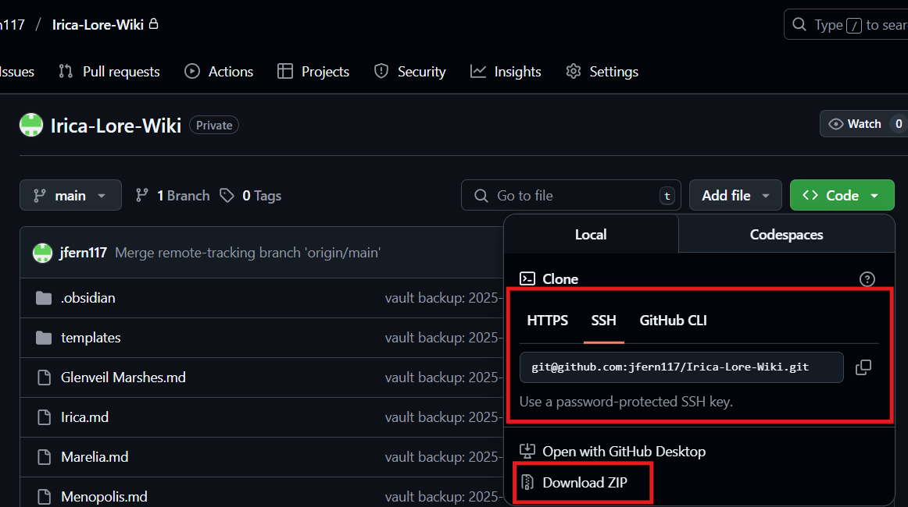

# Overview
This is intended to be a resource for all members of our campaign for keeping track of the lore we've learned. It's also meant to be a bit silly and community driven. If you have questions about how to help out, feel free to ask Jimmy!
# Getting Started
To work with the wiki, you'll need to install [Obsidian](https://obsidian.md/), its free and available for a bunch of platforms, and then download this repo and open it up in obsidian. 

This image shows the button to click when you open obsidian for the first time to select the folder and open the wiki. The relevant selection is boxed in red.

You can download the full wiki in two ways on Github. 
1. **Zip download:** This is the simple but less useful method. You can get a static download of the full wiki, unzip it, and open that folder with your copy of obsidian. I'd personally recommend against using the wiki this way (easier at first, way harder in the long run).
2. **Git Clone:** You can "clone" a copy of the repo locally, and keep it synced to the online copy with either (1) a few command line arguments or (2) a GUI application (see [Github Desktop](https://desktop.github.com/download/)). Github is designed to be a way for large teams to manage a software project by working on local copy and updating to and from the online copy. This is the preferred way to work with the wiki, especially if you'd like to contribute. As a bonus, there's an extension that should enable you to contribute completely in the obsidian app once you get it all setup!

The following image shows a screenshot of how you can start the process of doing either of these. Click the green "code" button on the home page, and the pop up will let you get the necessary files. The relevant sections are boxed in red.

If you haven't worked with git (and are feeling a bit ambitious), here's a [tutorial](https://www.w3schools.com/git/default.asp?remote=github) targeted at people who want to develop code. If you aren't so bold but want help getting the basics, ask Jimmy for help!

# Contributing Guidelines
All party members are encouraged to contribute to this shared project, whether you only want to add your character information or want to help keep the lore we learn up to date. Jimmy is making templates for the major types of things that will likely be in the wiki (NPCs, locations, etc) and has also made an entry for each party member to fill out.

Rather than spend a bunch of time trying to get everything perfect, I'm opting to get a decent framework up and improve it over time. Happy to hear feedback. 

Here's some additionally resources to help you get started with the basics (will add to these as I find them):
1. An [obsidian tutorial](https://obsidian.rocks/getting-started-with-obsidian-a-beginners-guide/#Getting-Started-with-Obsidian-Notes) (I'd recommend starting at section 4)
