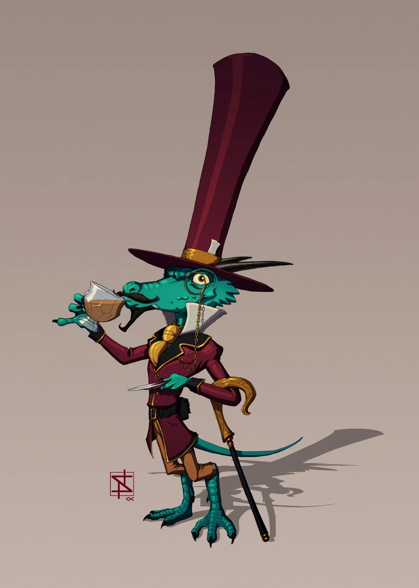

# Appearance
A highly intelligent blue kobold dressed in refined clothing.

source: https://www.reddit.com/r/DnD/comments/aiouc7/art_a_fancy_kobold/
# Known History
**Professor Smarty D'Goodread** and I have spent many long years on the road, studying the world, its history, and its inhabitants. Prof. D'Goodread has a storied history as intellectual success in a broad range of fields. This includes work as an author, cartographer, inventor, philosopher, and a travelling salesman. He is a gentleman, a scholar, an intellectual, and the finest friend a fellow could have.

Our latest interests include the [[Irica|Irican Continent]], and a powerful [[The Party|party]] of adventures we encountered on the road. He is the current owner and proprietor of the [[Pierpoint Manor]], though he travels often from his home in search of knowledge. 

# Previous Encounters

## The Road to Arborcrest: First encounter
The [[The Party|party]] first encountered the professor and I on the road to the village of [[Arborcrest]]. We took an immediate interest in them based on how effectively they handled an ambushing group of bandits. This is something truly special and worth documenting. Unbeknownst to these group of adventures, this was the moment the professor and I decided to start documenting their legend. A scholar must pick winning bets early.

Following this, the group of us spent some time at the the professors [[Pierpoint Manor|manor]], where strange happenings did happen indeed. 

# Notes
- Prof. D'Goodread tells me that one of the [[The Party|party]] members, [[Osbert Ashbourne|Osbert]], observed him without his hat after a fall. This is troubling news. 
